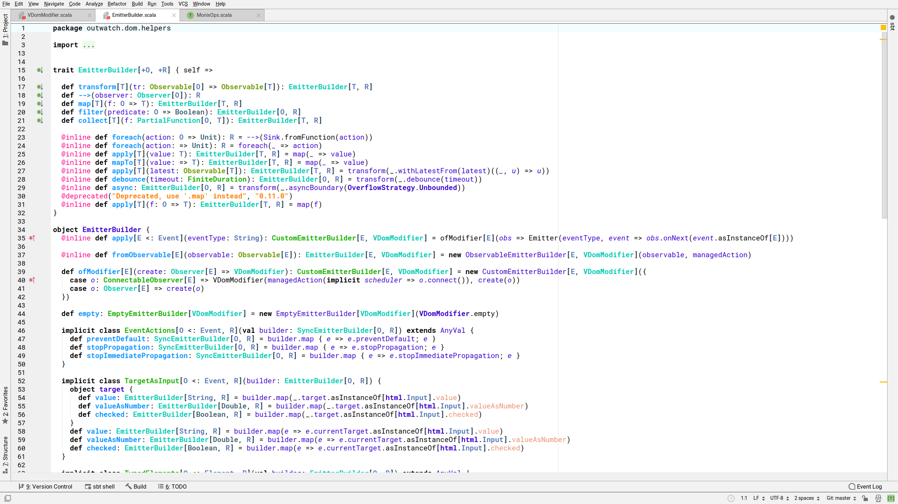
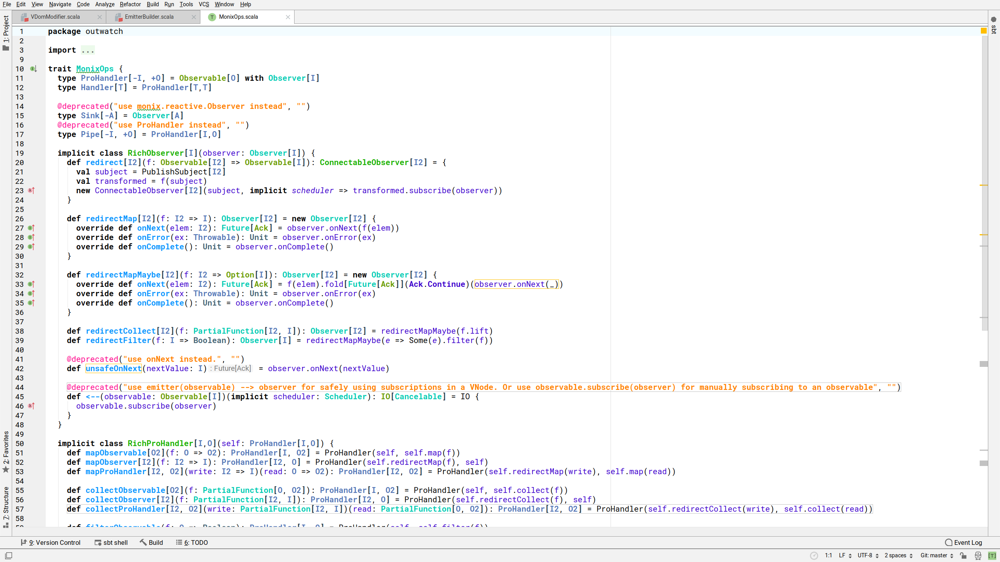
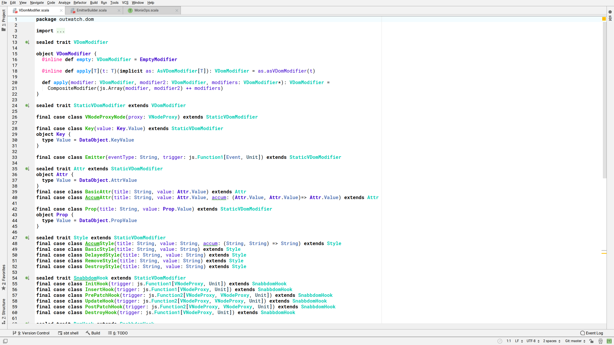
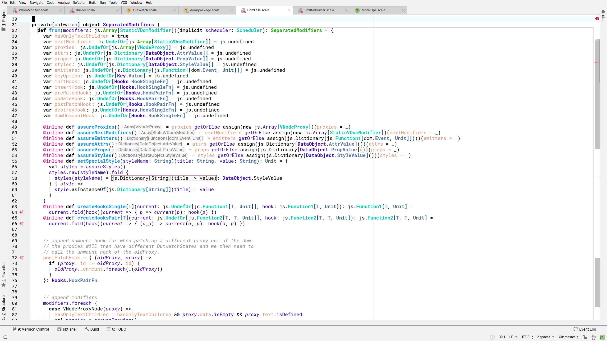

# Sabuni

Light Colorscheme for IntelliJ IDEA

## Goals

* Focused on Scala, but also works well for Java
* Light with high contrast, useful for working with daylight or outside
* Semantic highlighting
    * Make mutability (currently only vars) visible
    * Distinguish usages of `class`, `trait`, `abstract class` and `object`
    * Mark implicit conversions

## Installation

1. Clone this repository or download `sabuni.icls`.
2. In IDEA, go to `File | Settings... | Editor | Color Scheme`. Click the :gear:, select `Import Scheme...` and select `sabuni.icls`.

## Screenshots

The font used in the screenshots is [Roboto Mono](https://fonts.google.com/specimen/Roboto+Mono).

